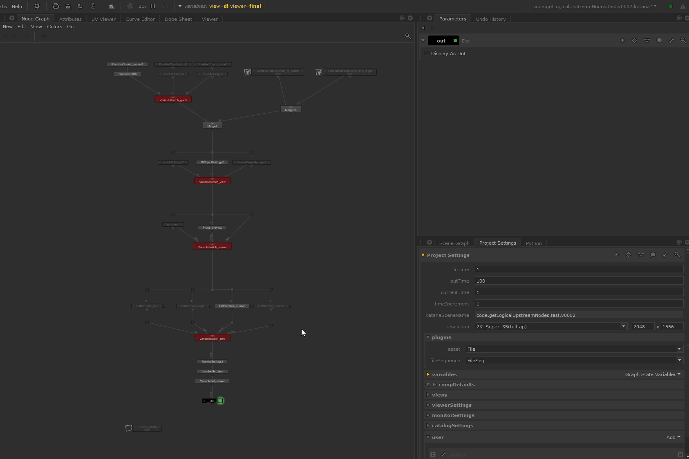

#  GSV Dashboard (GSVDB)

Preview and edit the Graph State Variables (GSV) at the current point in your
nodegraph (or anywhere). List local and global GSVs.

# Features

- Local and Global GSVs listing.
- Scene parsing modes for GSV listing :
  - logical_upsteam
  - upstream
  - all scene
- List all the GSV values *used in parsed scene*.
- Non-already-edited GSV can be edited using the possible values found.
- Listing of node using X selected GSV. (node can be selected)
- Scene parsing setting can be set from a node in the scene.

# Documentation

> Or see the [./doc directory](doc).

# Licensing 

**Apache License, Version 2.0** (OpenSource)

See [LICENSE.md](./LICENSE.md).

Here is a quick resume :

- ✅ The licensed material and derivatives may be used for commercial purposes.
- ✅ The licensed material may be distributed.
- ✅ The licensed material may be modified.
- ✅ The licensed material may be used and modified in private.
- ✅ This license provides an express grant of patent rights from contributors.
- 📏 A copy of the license and copyright notice must be included with the licensed material.
- 📏 Changes made to the licensed material must be documented

