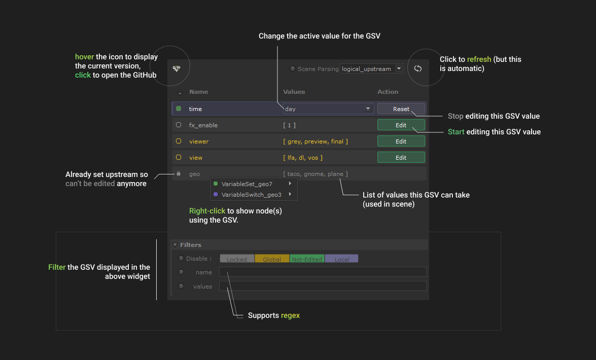
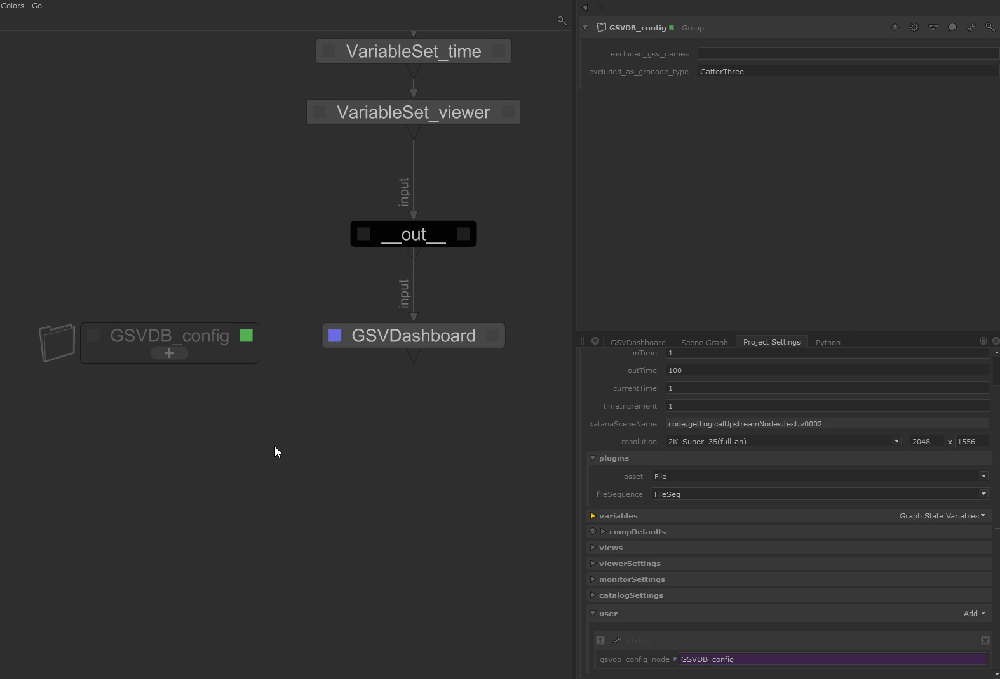

#  Index

Welcome on the GSVDB supertool's documentation.

[](../README.md)


## Installation

Copy the [`GSVDashboard`](../GSVDashboard) directory into the `SuperTools` directory of a
location registered by the `KATANA_RESOURCES` env variable.

```batch
:: D:/myShelf/SuperTools/GSVDashboard/...
"ROOT=D:/myShelf"
"KATANA_RESOURCES=%ROOT%"
```

> Tested on Katana 4.0v2 and 4.5v1, no guarantee it works on lower versions
> (but it should).

## Use




Make sure the node is always viewed when using `logical_upstream` mode.

**Some reminder about GSVs :**

- Only the most upstream "Setter" node determine which GSV value is being used.
That's why if a GSV is edited upstream , it became locked. A GSV is considered
"set" when a `VariableSet` or a `VariableDelete` node is found upstream (non-disable).

- If a global GSV is edited locally, the local value override the global value.
This mean you can't use the "GSV Menu Bar" (at top) anymore for this variable.


### Parsing settings




If no setting are specified default are :

```python
excluded_gsv_names = ["gaffersate"]
excluded_as_groupnode_type = ["GafferThree", "Importomatic"]
```

You can specify scene parsing settings using user parameters. Root of these
parameters can be one of (are in resolution order) :

- on a node named `GSVDB_config`
- on any node whose name is specified in the `project.user` parameters as :
  ```
  project.user.gsvdb_config_node = "(str)name of the node with the settings"
  ```
- Directly on `project.user` parameters

Here are the supported `user` parameters setup :

```markdown
- excluded_gsv_names(str): comma separated list
    - gsvdb_excluded_gsv_names: same as above
- excluded_as_grpnode_type(str): comma separated list
    - gsvdb_excluded_as_grpnode_type: same as above
```

---

[](../README.md)
