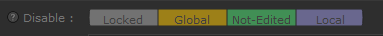

#   Index

Welcome on the GSVDb supertool's documentation.

[](../README.md)
[](INDEX.md)
[](API.md)

## Installation

Copy the [`GSVDashboard`](../GSVDashboard) directory into the `SuperTools` directory of a
location registered by the `KATANA_RESOURCES` env variable.

```batch
:: D:/myShelf/SuperTools/GSVDashboard/...
"ROOT=D:/myShelf"
"KATANA_RESOURCES=%ROOT%"
```

> Tested on Katana 3.6v5, 4.0v2 and 4.5v1, no guarantee it works on lower
> versions (but it should).

## Use


> ⚠ Make sure the node is always viewed when using `logical_upstream` mode.

If in the `values` list you see a `DELETED` value, this mean a VariableDelete
node was used at some point.

### Editing

When a GSV is edited, a ComboBox widget will appear that will allow you to
choose which value to set for this GSV. For some node like the OpScript node
it is not possible to get the values this GSV can be set to, and as such it's 
assumed to be editable with any value, represented by a `*`. In that case
the ComboxBox become editable, and you can delete the `*` to replace it by any
text.

### Filtering

You can filter per-node the GSV listed in the widget. You have 3 options :

#### Disable



By default all 4 types are enabled.

You can choose to disable the GSV type specified in the label. Like clicking
`Not-Edited` will remove all GSV that are not currently edited by this SuperTool
node.

The node is a capsule widget. To set it with an expression you can use a comma
separated list of labels like   
> `"Locked, Global, Local"`

#### names

Only display GSV names matching this regular expression.

The expression is Python regex formatted. 
It is evaluated using `re.search(gsv_name)`

> 💡 **tips**
> 
> If you want to exclude names instead of isolating them, you can
> use the regex syntax `[^...]` .  
> Example: `[^fx_enable][^shading]` will exclude all GSVs names matching 
> `fx_enable` and `shading`.

#### values

Only display GSV who got at least one value matching this regular expression.

The expression is Python regex formatted. 
It is evaluated using `re.search(gsv_value)`

### Some reminder about GSVs :

- Only the most upstream "Setter" node determine which GSV value is being used.
That's why if a GSV is edited upstream , it became locked. A GSV is considered
"set" when a `VariableSet` or a `VariableDelete` node is found upstream (non-disable).

- If a global GSV is edited locally, the local value override the global value.
This mean you can't use the "GSV Menu Bar" (at top) anymore for this variable.


### Parsing settings

Change how upstream nodes are found.


If no setting are specified default are :

```python
excluded_gsv_names = ["gaffersate"]
excluded_as_groupnode_type = [
  "GafferThree",
  "Importomatic",
  "LookFileLightAndConstraintActivator",
  "LookFileMultiBake",
  "LookFileManager",
  "NetworkMaterials",
  "ShadingGroup",
]
```

You can specify scene parsing settings using `user parameters`. Root of these
parameters can be one of (are in resolution order) :

- on a node named `GSVDB_config`
- on any node whose name is specified in the `project.user` parameters as :
  ```
  project.user.gsvdb_config_node = "(str)name of the node with the settings"
  ```
- Directly on `project.user` parameters

Here are the supported `user` parameters setup :

```markdown
- excluded_gsv_names(str): comma separated list
    - gsvdb_excluded_gsv_names: same as above
- excluded_as_grpnode_type(str): comma separated list
    - gsvdb_excluded_as_grpnode_type: same as above
```

---

[](../README.md)
[](INDEX.md)
[](API.md)
