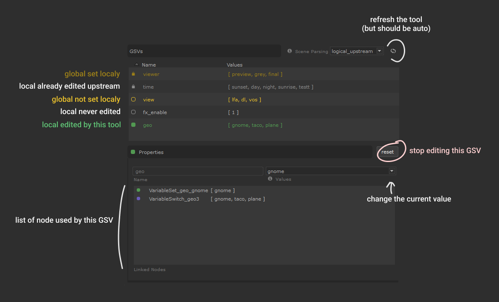

#  GSV Dashboard (GSVDB)

Preview and edit the Graph State Variables (GSV) at the current point in your
nodegraph (or anywhere). List local and global GSVs.


## Features

- Local and Global GSVs listing.
- Scene parsing modes for GSV listing :
  - logical_upsteam
  - upstream
  - all scene
- GSV values *used in parsed scene* listing
- Non-already-edited GSV can be edited using the values found.
- Listing of node using X selected GSV. (can be selected)
- Scene parsing setting can be set from a node in the scene.

## Installation

Put the parent `GSVDashboard` into the `SuperTools` directory of a
location registered by the `KATANA_RESOURCES` env variable.

```batch
:: D:/myShelf/SuperTools/GSVDashboard/...
"ROOT=D:/myShelf"
"KATANA_RESOURCES=%ROOT%"
```

## Use




Make sure the node is always viewed when using `logical_upstream` mode.

**Some reminder about GSVs :**

- Only the most upstream "Setter" node determine which GSV value is being used.
That's why if a GSV is edited upstream , it became locked.

- If a global GSV is edited locally, the local value override the global value.
This mean you can't use the "GSV Menu Bar" (at top) anymore for this variable.


### Parsing settings


If no setting are specified default are :

```python
excluded_gsv_names = ["gaffersate"]
excluded_as_groupnode_type = ["GafferThree", "Importomatic"]
```

You can specify scene parsing settings using user parameters. Root of these
parameters can be one of (are in resolution order) :

- on a node named `GSVDB_config`
- on any node whose name is specified in the `project.user` parameters as :
  ```
  project.user.gsvdb_config_node = "(str)name of the node with the settings"
  ```
- Directly on `project.user` parameters

Here are the supported `user` parameters setup :

```markdown
- excluded_gsv_names(str): comma separated list
    - gsvdb_excluded_gsv_names: same as above
- excluded_as_grpnode_type(str): comma separated list
    - gsvdb_excluded_as_grpnode_type: same as above
```


## Licensing 

**Apache License, Version 2.0** (OpenSource)

See [LICENSE.md](./LICENSE.md).

Here is a quick resume :

- ✅ The licensed material and derivatives may be used for commercial purposes.
- ✅ The licensed material may be distributed.
- ✅ The licensed material may be modified.
- ✅ The licensed material may be used and modified in private.
- ✅ This license provides an express grant of patent rights from contributors.
- 📏 A copy of the license and copyright notice must be included with the licensed material.
- 📏 Changes made to the licensed material must be documented

